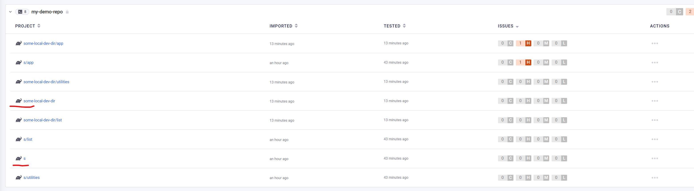

# Snyk Gradle Issues


## Issue 1: Scan doesn't work if root build.gradle doesn't exist
```sh
snyk monitor --org=MY_ORG_ID --remote-repo-url=my-demo-repo --all-sub-projects

Monitoring /home/max/temp/gradle-snyk-demo/s...

Could not detect supported target files in /home/max/temp/gradle-snyk-demo/s.
Please see our documentation for supported languages and target files: https://snyk.co/udVgQ and make sure you are in the right directory.
```
If i do `touch build.gradle` in the root folder, it works.

## Issue 2: Gradle scan doesn't rely on project name

The root project name is set in the `settings.gradle`

```groovy
rootProject.name = 'my-demo'
```

Therfore I would expect snyk derives the project names somehow from the gradle project name

If I run it in azure devops where the folder name is `s` the project name is `s` and not `my-demo`
If I run it locally where the folder might by `some-local-dev-dir` the project name is `some-local-dev-dir` and not `my-demo`

```sh
snyk monitor --org=MY_ORG_ID --remote-repo-url=my-demo-repo --all-sub-projects
```

As a result I see duplicated projects in snyk with different names.


